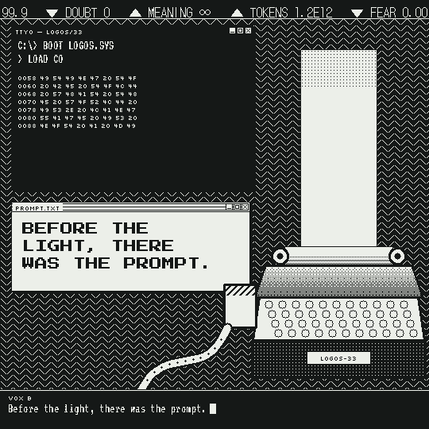

# The Good Word (v2)

A 76-second, 1080×1080 film about intelligence arising from text, made entirely with code.
Every pixel is drawn with NumPy and OpenCV, the music is synthesized from raw waveforms, and
the narration uses two open-source Piper text-to-speech voices. No image or video models are used.

**Warning:** the film contains rapid flashing and full-screen inversions.

[Watch the full film (76 seconds, with sound)](media/the_good_word_v2.mp4)

---

## Quick start

If you already have Python 3.10+ and ffmpeg installed:

    pip install -r requirements.txt
    ./build.sh

About three minutes later you'll have `the_good_word_v2_manga.mp4` in this folder.

---

## Step-by-step setup

### 1. Install Python (3.10 or newer)

- **macOS:** `brew install python`, or download it from python.org
- **Linux (Debian/Ubuntu):** `sudo apt install python3 python3-venv python3-pip`
- **Windows:** use WSL (Windows Subsystem for Linux), then follow the Linux steps.
  The build scripts are bash scripts, so WSL is the easiest route.

Check it worked: `python3 --version`

### 2. Install ffmpeg

- **macOS:** `brew install ffmpeg`
- **Linux:** `sudo apt install ffmpeg`
- **Windows (inside WSL):** `sudo apt install ffmpeg`

Check it worked: `ffmpeg -version`

### 3. Download the code and open a terminal in the folder

    git clone https://github.com/darrenangle/good-word-v2.git
    cd good-word-v2

### 4. Create a virtual environment and install the Python packages

    python3 -m venv .venv
    source .venv/bin/activate
    pip install -r requirements.txt

(Next time, just run `source .venv/bin/activate` before working on the project.)

### 5. Build the film

    ./build.sh

The first run downloads the fonts and voices, so it needs an internet connection.
When it finishes, open `the_good_word_v2_manga.mp4`.

---

## What `build.sh` does

| Step | Command | Output |
|---|---|---|
| 1. Download assets | `./fetch_assets.sh` | `fonts/`, `voices/` |
| 2. Narration | `python3 tts2.py` | `tts/*.wav`, `tts/lines.json` |
| 3. Word timing | `python3 align.py` | `tts/words.json` (when each word is spoken) |
| 4. Music stems | `python3 audio2.py synth` | `stems2.npz` |
| 5. Mix and master | `python3 audio2.py mix voice=2.7 vfx=1.5 coda=1.05` | `score2.wav` |
| 6. Picture | `python3 video2.py render …` (six chunks) | `chunks/*.mp4` |
| 7. Final file | ffmpeg concat + mux | `the_good_word_v2_manga.mp4` |

You can run any step on its own. For example, if you only change the music,
rerun steps 4–5 and 7 without re-rendering the picture.

---

## Previewing and iterating

Render a contact sheet of any timestamps (in seconds). This is much faster than a full render:

    python3 video2.py sheet preview.png 11.3 23.6 41.0 59.4

Render just one section (frames are at 30 fps, so frame 900 = 30 seconds):

    python3 video2.py render 900 1050 test.mp4

Remix the audio with a different balance (higher numbers = louder):

    python3 audio2.py mix voice=3.0 vfx=1.2 coda=1.0

Available mix levels: `saw arp lead bass drums clk choir fx bells voice vfx coda`.

---

## Customizing

**Change the words.** Edit `LINES` in `tts2.py`. Each line has a voice (`F` female,
`M` male, `FM` both in unison), a speed (lower = faster), and the text. Then:

1. Rerun `tts2.py` and `align.py`.
2. Check that no lines overlap. Start times live in `VOICE_T` in `timeline2.py`.
3. Rerun `audio2.py synth`, `audio2.py mix`, and the render.

The big on-screen word slams are keyed to specific words inside `video2.py`
(search for `slam(`). If you change a line, update the matching slam words too.

**Change the colours.** Edit `PALETTE` near the top of `video2.py`: the first row is the ink colour,
the second is the paper colour (RGB).

**Change the tempo or structure.** `BPM` and the section start times `SEC` are in `timeline2.py`.
Picture, drums, music and narration all hang off these, so small changes are safest.

**Change the resolution.** The film is drawn at 540×540 and scaled 2× to 1080×1080.
The layouts are hand-placed for 540, so change the output scale (the `scale=1080:1080`
filter in `video2.py`) rather than `RES`.

---

## Troubleshooting

- **`Permission denied: ./build.sh`** — run `chmod +x build.sh fetch_assets.sh`
- **`ffmpeg: command not found`** — ffmpeg isn't installed or isn't on your PATH (see step 2).
- **Font or voice download fails** — check your connection and rerun `./fetch_assets.sh`.
  It skips anything already downloaded.
- **Running out of memory** — the audio step needs roughly 2 GB of free RAM.
  Close other apps and retry.
- **Rebuild doesn't exactly match the posted video** — expected. Piper varies slightly
  between runs, so narration clips can come out a little different in length.
  `align.py` re-measures word timings automatically.

---

## Files

| File | What it does |
|---|---|
| `timeline2.py` | The shared clock: sections, BPM, narration start times, drum pattern, word timings. Audio and picture both read from it, which keeps them in sync. |
| `tts2.py` | The script and the two voices (A = lessac, female; B = ryan, male). |
| `align.py` | Finds where each word actually starts in the audio, so on-screen text lands on the spoken word. |
| `audio2.py` | The score (supersaws, breakbeats, teletype clicks, choir, key change, tape stop) and the mix. |
| `video2.py` | The renderer: every scene, drawn in two tones at 540×540. |
| `fetch_assets.sh` | Downloads fonts and voices. |
| `build.sh` | Runs the whole pipeline end to end. |
| `tts/lines.json`, `tts/words.json` | The line and word timings used for the released cut. |
| `media/preview.gif`, `media/the_good_word_v2.mp4` | The excerpt shown above and a 540×540 copy of the finished film. |

---

## Credits and licences

- **Fonts:** Press Start 2P, VT323, Silkscreen and DotGothic16, under the SIL Open Font License, via github.com/google/fonts.
- **Voices:** Piper (github.com/rhasspy/piper), en-us-lessac-medium and en-us-ryan-high. See each voice's `MODEL_CARD` for its licence.
- **Code, script and music:** written by Claude (Anthropic) in conversation with the director.
